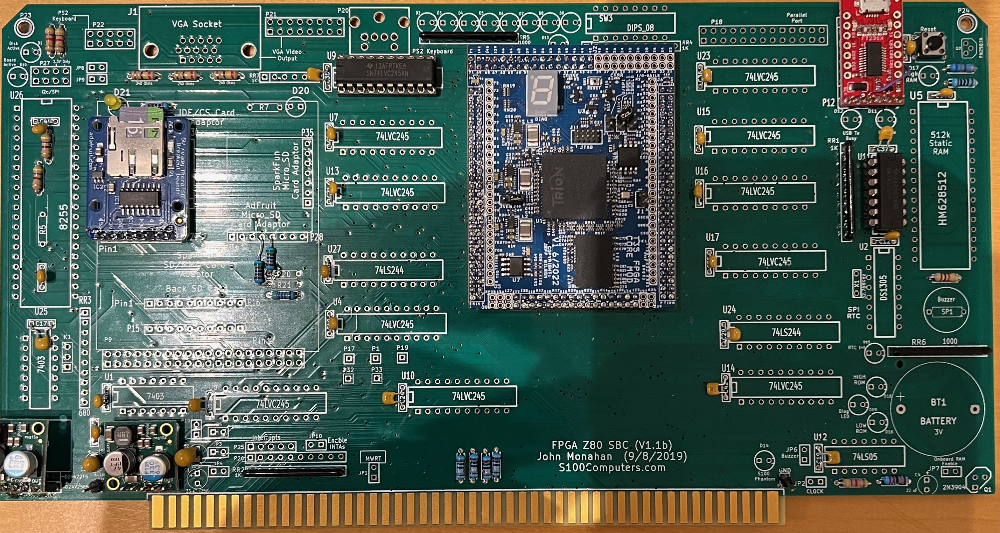

This is a port of the Retrobrew
[MC-2G-1024](https://www.retrobrewcomputers.org/doku.php?id=builderpages:rhkoolstar:mc-2g-1024)
system to the S100computers.com
[FPGA_Z80_SBC](http://www.s100computers.com/My%20System%20Pages/FPGA%20Z80%20SBC/FPGA%20Z80%20SBC.htm)
board that uses Jeff Wilson's [Efinix T35 FPGA
Module](https://github.com/s100projects/T35_FPGA_MODULE) as its FPGA
base.

There are currently two system configurations available. The simpliest
one is Microcomputer_TTY and uses a serial port as its interface. The
other is Microcomputer_VGA and can use the VGA and PS2/ as its
console, or use a serial port.

## System Hardware Components

The Microcomputer_TTY configuration contains

  * a Z80 CPU running at 25 MHz in the FPGA.
  
  * 128K SRAM using the block RAM in the FPGA.
  
  * a UART using the Sparkfun USB-to-serial adapter of the S100 FPGA Z80
    SBC.
  
  * an SD card using either Adafruit (P29) or Sparkfun adapters (P34 or
    P15) of the S100 FPGA Z80 SBC.
  
The Microcomputer_VGA configurations adds

  * a VGA port supporting monochrome text at 640x480@60Hz. The eight
    colors supported by the hardware may work but I have not tested that.

  * a Standard PS/2 port. **You must have completed the T35 FPGA
    module wire modification described on Jeff's page for this to work.**

When using the Microcomputer_VGA configuration the boot ROM will
display "Press \[SPACE\] to activate console." on both the VGA display
and the UART.  Press the space key on the appropriate device to select
the console.

Note that although this port is for the S100computers FPGA Z80 SBC,
there is currently no support for actually accessing the S100 bus.

For the Microcomputer_TTY configuration only, the boot ROM for the
system requires that two UARTs be present in the system, but the FPGA
Z80 SBC natively only supports one UART. I have adopted the trick used
by Lawrence documented [here](https://ve7it.cowlug.org/fpga_gs.html)
to repurpose a few of the parallel port pins as a UART. This second
UART is not necessary to use the system past boot time, but you can
use it via the appropriate cable if desired.

Be sure to add the two SD card pull up resistors mentioned in the
"Notes" section at the bottom of the S100 FPGA Z80 SBC write up linked
above.

## System Software Components

The system software is found in the MC-2G-1024.zip available on the
MC-2G-1024 page mentioned above. Download the ZIP file, extract it,
and write the System18.img file to an SD card.

The MC-2G-1024 contains systems for CP/M 2.2, Dos+ 2.5, CP/M 3.0,
MPMII 2.1, ZSDOS 1.1/ZCPR2, ZPM3/ZCCP and NASCOM ROM Basic. The MPMII
system does not yet work for this port.

The SD card also contains a number of application directories. See the
`system18.txt` file on the MC-2G-1024 home page given above for a
quick list. Be sure to read the various documentation files in the ZIP
file, especially the information about the `MOUNT` command.

## Bitstreams

There are four pre-compiled bitstreams in the `bitstreams` directory:

| Bitstream                     | RAM                | IO1  | IO2        | Programming Mode |
|-------------------------------|--------------------|------|------------|------------------|
| Microcomputer_TTY_Int128K.bit | 128K FPGA internal | UART | UART       | JTAG             |
| Microcomputer_TTY_Int128K.hex | 128K FPGA internal | UART | UART       | SPI Active x4    |
| Microcomputer_VGA_Int128K.bit | 128K FPGA internal | UART | VGA & PS/2 | JTAG             |
| Microcomputer_VGA_Int128K.hex | 128K FPGA internal | UART | VGA & PS/2 | SPI Active x4    |

The bitstreams with the `.bit` extension is used for programming via
JTAG, while the one with the `.hex` extensions is used for programming
via the SPI Active x4 mode. Refer to Jeff's instructions linked above
for programming details.

## Efinix Project

To load this project into the Efinix IDE, use either the
`Microcomputer_TTY/Microcomputer_TTY.xml` or
`Microcomputer_VGA/Microcomputer_VGA.xml` project files. 

Some changes I have made from the original MC-2G-1024 files include:

  * Adding an Internal128K.vhd file
  
  * Changing the display RAM VHDL files to use inferred RAMs instead of 
    Altera specific ones.

  * Changing the various Z80 and display ROM files from using an 
    init HEX file to hardcoding the byte values directly in VHDL, for simplicity.

You'll need to run `git submodule init` followed by `git submodule
update` before compiling the code to pull in the MultiComp base code
from an external repository.

## Note for using the Efinix programmer under Linux.

I've noticed that the Efinix programmer software will fail under Linux
if the USB-to-serial board of the FPGA Z80 SBC is plugged into the
Linux computer.  I think the Efinix software gets confused by the
presence of two FTDI devices in the system. Unplug the cable from the
USB-to-serial board before attempting to program.

## Minimal SBC Build

This is a example of the minimum hardware that needs to be assembled
for the FPGA Z80 SBC board for the TTY configuration of this
MC-2G-1024 port to work. I started with all the resistors, capacitors
and four of the resistor networks and added:

  * the 5 volt and 3.3 volt regulators

  * the T35 FPGA module

  * the USB-to-serial board

  * the parts needed for the board reset circuit (U1, U9 and reset
    switch)

  * an SD card module that uses SD_CS_A for its chip select

